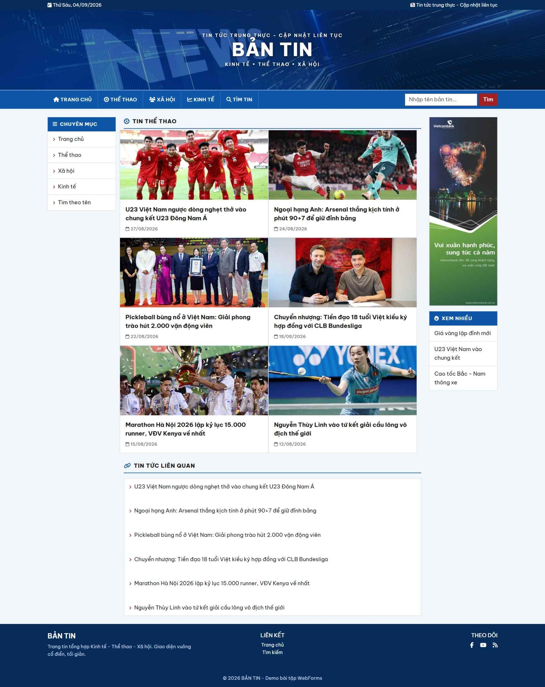
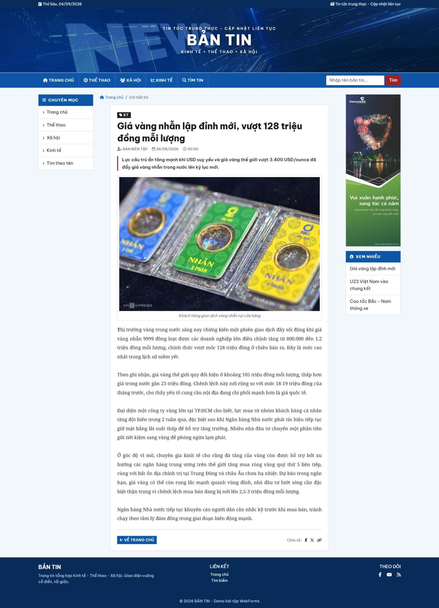
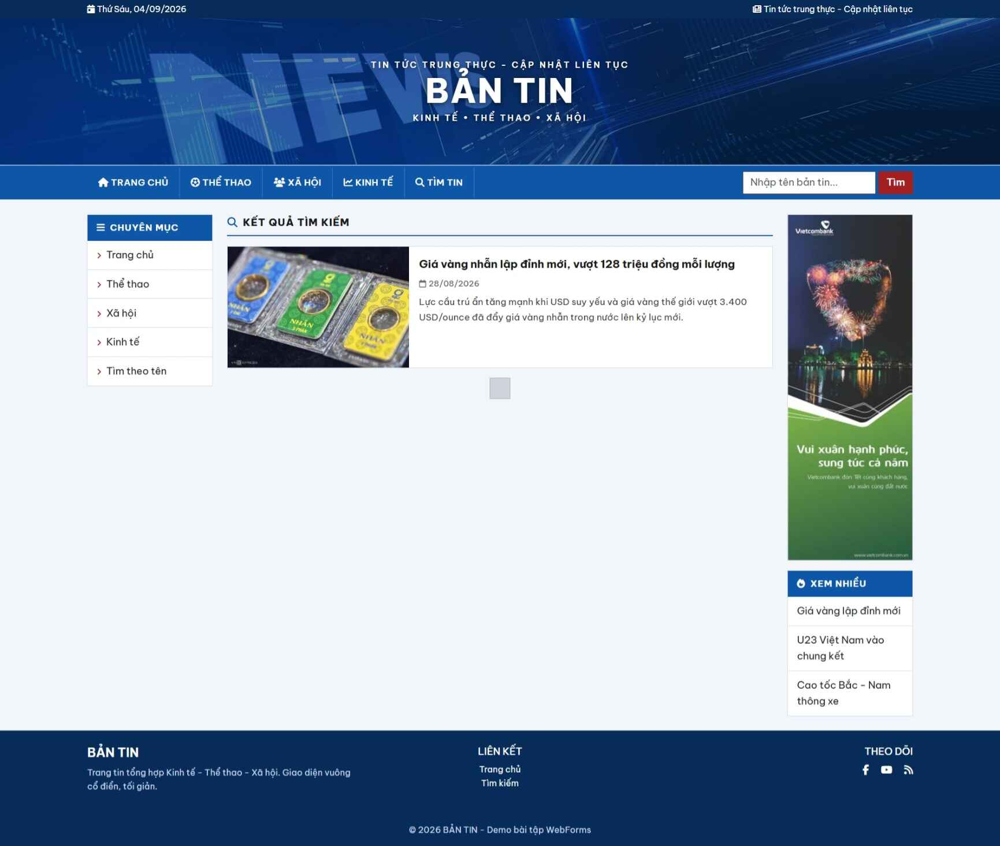

# Bantin - Website tin tức tổng hợp

Project ASP.NET Web Forms (.NET Framework 4.8.1) - website tin tức Kinh tế, Thể thao, Xã hội.

## Chức năng chính

- Trang chủ: tin mới nhất (sắp xếp theo ngày đăng) + tin liên quan
- Trang chuyên mục Kinh tế / Thể thao / Xã hội (lưới 2 cột) + tin liên quan
- Xem chi tiết bản tin (tiêu đề, ngày đăng, ảnh + chú thích, tóm tắt, nội dung)
- Tìm kiếm bản tin theo tiêu đề (ô tìm kiếm trên navbar, trang tìm theo tên)
- Kết nối SQL Server qua connection string duy nhất trong `Web.config`

## Giao diện

Trang chủ | Danh mục
--- | ---
 | 

Chi tiết bản tin | Kết quả tìm kiếm
--- | ---
 | 

## Công nghệ

- ASP.NET Web Forms (.NET Framework 4.8.1)
- LINQ to SQL
- Bootstrap 5, Font Awesome 6.5
- SQL Server (LocalDB)

## Cài đặt

1. Mở `bantin.slnx` trong Visual Studio
2. Tạo database `TinTuc` trên `(localdb)\MSSQLLocalDB`
3. Chạy script SQL trong `dev/database.sql` để tạo bảng và seed dữ liệu mẫu
4. Build và chạy (F5)
